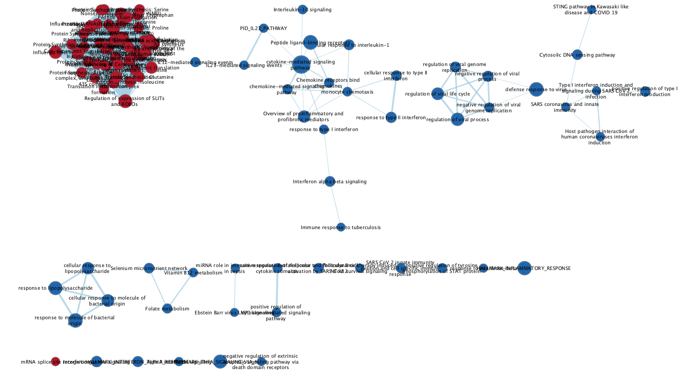
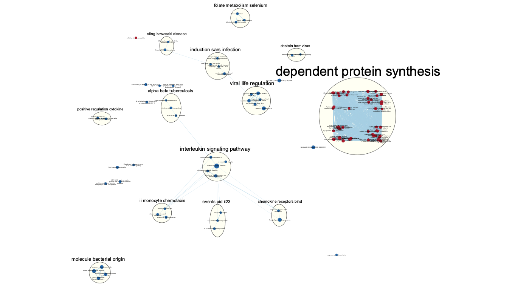
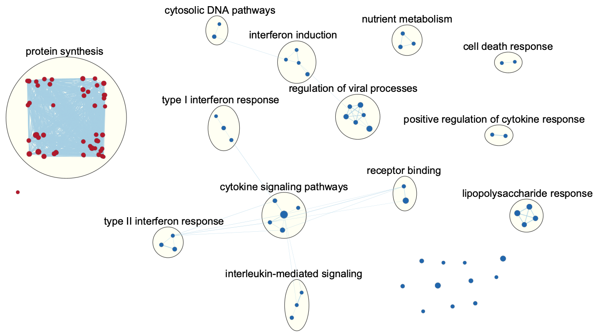
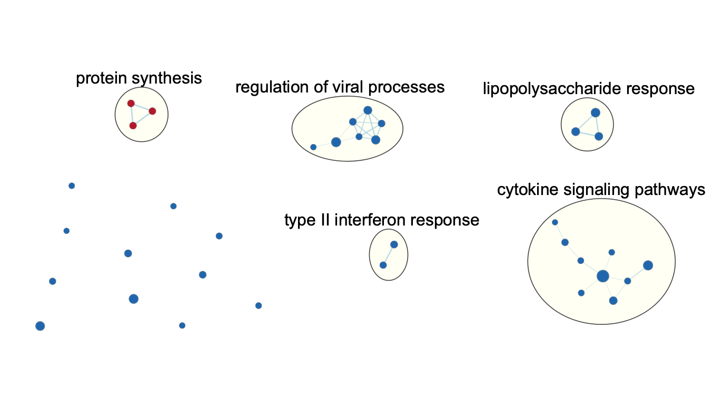

# Introduction

The RNA-seq data used in this analysis are available on GEO with GEO accession [GSE235094](https://www.ncbi.nlm.nih.gov/geo/query/acc.cgi?acc=GSE235094). These data were collected for a publication investigating the ability of human monocytes to acquire trained immunity after SARS-CoV-2. To perform the experiment, the authors divided the monocytes into four groups named Trn_S-LPS, Trn_S-Med, Unt-LPS, and Unt-Med. The monocyte samples being studied were cultured over 7 days. Before beginning culture, the authors exposed two treatment groups (Trn_S-LPS and Trn_S-Med, which the authors referred to as trained) to inactivated SARS-CoV-2 (iSARS-CoV-2). The two control groups (Unt-LPS and Unt-Med, which the authors referred to as untrained) were left unexposed to the virus. On the sixth day of culture, one treatment and one control group (Trn_S-LPS and Unt-LPS) were additionally exposed to lipopolysaccharide (LPS), a molecular pattern associated with various pathogens. The other two groups (Trn_S-Med and Unt-Med) were not exposed to LPS and kept in the growth medium [@cvetkovic2023].

The figure below is adapted from Figure 2 of the authors' publication. This figure shows the secretion levels of certain cytokines and chemokines of monocytes grouped by whether they were exposed (trained) or not exposed (untrained) to iSARS-CoV-2 and whether they were exposed to LPS on day 6 [@cvetkovic2023].


Previously, we cleaned the data and removed samples that were outliers, most likely due to measurement errors. The cleaned data had 4 samples in the group Unt-LPS and 5 samples in each of the three other groups (Trn_S-LPS, Trn_S-Med, and Unt-Med). Normalization was performed using trimmed mean of M-values (TMM) implemented in the package edgeR [@edgeR]. The final expression matrix generated from the data had 11,390 genes (rows) across the 19 samples (columns).

Genes from the Trn_S-LPS group were then tested for differential expression using quasi-likelihood tests also from edgeR [@edgeR]. To correct p-values for testing multiple hypotheses, the Benjamini-Hochberg method for controlling the false discovery rate (FDR) was used. We then performed thresholded over-representation analysis separately on significantly upregulated genes and significantly downregulated genes using gprofiler2, an R interface for g:Profiler [@gprofiler2]. The top annotations returned for the set of significantly upregulated genes were all related to either mRNA translation or the assembly of ribosomal proteins and rRNAs into ribosomes. The top annotations returned for the set of significantly downregulated genes were associated with immune responses, such as defense responses to viruses and cytokine-mediated signaling.

# Data Setup

We first need to rerun code from Assignment 2 using knitr to obtain the results of differential expression tests [@knitr].

```{r, fig.show='hide', results='hide', error=FALSE, message=FALSE, warning=FALSE}
# Save Assignment 2 code into a temporary R file and run it
options(knitr.duplicate.label = "allow")
knitr::purl("A2_Gavin_Pu.Rmd", "A2_Gavin_Pu.R")
source("A2_Gavin_Pu.R")
```

The differential expression test results are stored in a variable named `results_glmQL`. The other variables, as well as the temporary R file created by knitr, can be deleted.

```{r}
# Remove objects that are not the differential expression test results
rm(list = ls()[ls() != "results_glmQL"])

# Delete the temporary R file
unlink("A2_Gavin_Pu.R")
```

# Non-Thresholded Gene Set Enrichment Analysis

To perform non-thresholded gene set enrichment analysis, we first need to create an RNK file. RNK files contain gene symbols and the rank of each gene.

```{r}
# Gene names
genes <- rownames(results_glmQL)

# Gene ranks
ranks <- -1 * log10(results_glmQL$FDR) * sign(results_glmQL$logFC)

# Order genes by decreasing rank in a data frame
rnk <- data.frame(genes, ranks)
rnk <- rnk[order(rnk$ranks, decreasing = TRUE), ]
rnk$ranks <- format(rnk$ranks, scientific = FALSE)

# Create a RNK file
rnk_file <- "gene_set.rnk"
write.table(rnk, rnk_file, quote = FALSE, sep = "\t", row.names = FALSE,
            col.names = FALSE)
```

We also need a GMT file containing the gene sets to be used in the analysis. We will use RCurl to download the latest gene set from the Bader Lab containing GO biological processes, pathways, no PFOCR, and no IEA [@RCurl].

```{r, results='hide', error=FALSE, message=FALSE, warning=FALSE}
# Get the path to the current GMT file
gmt_url <- "http://download.baderlab.org/EM_Genesets/current_release/Human/symbol/"
html <- unlist(strsplit(RCurl::getURL(gmt_url), "\n"))
match <- gregexpr("(?<=<a href=\")(.+GOBP_AllPathways_noPFOCR_no_GO_iea.+\\.gmt)(?=\">)",
                  html, perl = TRUE)
gmt_file <- unlist(regmatches(html, match))

# Download the GMT file if not downloaded already
if (!file.exists(gmt_file)) {
  download.file(paste(gmt_url, gmt_file, sep = ""), destfile = gmt_file)
}
```

**What method did you use? What gene sets did you use? Make sure to specify versions and cite your methods.** I used the current release Bader Lab human gene sets with GO biological processes, pathways, no PFOCR, and no IEA. To perform gene set enrichment analysis, I used the GSEA v4.3.3 Mac App. Specifically, I ran GSEAPreranked with 1,000 permutations, no collapsing to gene symbols, a weighted enrichment statistic, a maximum gene set size of 200, and a minimum gene set size of 15. I did not use a chip platform [@subramanian2005].

**Summarize your enrichment results.** First, we will load in the TSV files containing the results from GSEA.

```{r}
# Directory of GSEA results
gsea_dir <- list.files(pattern = "\\.GseaPreranked")

# Load GSEA report tables
gsea_report_files <- list.files(path = gsea_dir,
                                pattern = "gsea_report_.*\\.tsv")
gsea_report_pos <- read.table(
  file.path(gsea_dir, grep("pos", gsea_report_files, value = TRUE)),
  header = TRUE, sep = "\t", quote = "\"", row.names = 1)
gsea_report_neg <- read.table(
  file.path(gsea_dir, grep("neg", gsea_report_files, value = TRUE)),
  header = TRUE, sep = "\t", quote = "\"", row.names = 1)
```

Below are tables produced with knitr of the ten pathways enriched for upregulated genes with the highest normalized enrichment scores (NES) and the ten pathways enriched for downregulated genes with the lowest NES [@knitr].

```{r, warning=FALSE}
# Table of top ten pathways enriched for upregulated genes
knitr::kable(gsea_report_pos[1:10, c("NES", "FDR.q.val")], type = "html",
             row.names = TRUE, col.names = c("Gene Set Name", "NES", "FDR"),
             caption = paste("**Table 1**: Top ten pathways enriched for",
                             "upregulated genes."))

# Table of top ten pathways enriched for downregulated genes
knitr::kable(gsea_report_neg[order(as.numeric(gsea_report_neg$NES)), ]
             [1:10, c("NES", "FDR.q.val")], type = "html", row.names = TRUE,
             col.names = c("Gene Set Name", "NES", "FDR"),
             caption = paste("**Table 2**: Top ten pathways enriched for",
                             "downregulated genes."))
```

The pathways enriched for upregulated genes with the highest NES are all related to protein synthesis with a specific amino acid. The pathways enriched for downregulated genes with the lowest NES are either defense responses or different kinds of regulation of viral processes. Additionally, many of the pathways related to defense responses are specific to certain types of cytokines, such as interferons, interleukins, or tumor necrosis factor (TNF) alpha. The FDR-corrected p-values of all of the top pathways for both upregulated and downregulated genes were calculated to be 0, indicating that all enriched pathways shown in the above two tables are highly significant.

**How do these results compare to the results from the thresholded analysis in Assignment #2? Compare qualitatively. Is this a straightforward comparison? Why or why not?** From our previous results obtained using thresholded over-representation analysis, we found that the top annotations for upregulated genes were all related to mRNA translation and the synthesis of ribosomes from ribosomal proteins and rRNA. In our current GSEA results, the top pathways enriched for upregulated genes are still related to translation, but are not specific to ribosome synthesis. However, this comparison is not entirely straightforward since general protein synthesis does include synthesis of ribosomal proteins, but we cannot be certain that it is ribosomal proteins being synthesized just by looking at the top pathways returned from GSEA for upregulated genes. For downregulated genes, we previously found using thresholded over-representation analysis that the top annotations returned were related to defense responses against viruses and responses to cytokine-mediated signaling. For the most part, these results do offer a straightforward comparison to our top pathways enriched for downregulated genes found from GSEA because both analyses found similar pathways related to viruses and cytokine responses.

# Visualization of Gene Set Enrichment Analysis in Cytoscape

**Create an enrichment map. How many nodes and how many edges in the resulting map? What thresholds were used to create this map? Make sure to record all thresholds. Include a screenshot of your network prior to manual layout.** We used the EnrichmentMap App from Cytoscape to create enrichment maps [@merico2010; @shannon2003]. To create an enrichment map, we used an FDR q-value cutoff of 0.001. To determine edges, we kept the "Data Set Edges" setting at automatic and "Connectivity" to halfway between sparse and dense. Our resulting enrichment map had 100 nodes and 1,230 edges. Below, we present the enrichment map prior to manual layout.

**Figure 1**: Enrichment map prior to manual layout. Legend adapted from [@reimand2019].




**Annotate your network. What parameters did you use to annotate the network? If you are using the default parameters, make sure to list them as well.** For the most part, our paramters were almost the same as the defaults. We used the clusterMaker App to create clusters [@morris2011]. We chose MCL cluster as the cluster algorithm and `similarity_coefficient` as the edge weighting column. We did not choose to create singleton clusters. To label clusters, we used `GS_DESCR` as the label column and WordCloud: Adjacent Words as the label algorithm [@oesper2011]. We set the maximum words per label to 3, the minimum word occurrence to 1, and the adjacent word bonus to 8. The following figure shows the annotated enrichment map without manual adjustment of the map layout or manual editing of annotations.

**Figure 2**: Annotated enrichment map prior to manual updating of annotations and manual layout. Legend adapted from [@reimand2019].




**Make a publication-ready figure. Include this figure with proper legends in your notebook.** We manually changed the layout of the enrichment map and performed manual updates to the cluster labels. A publication-ready enrichment map figure is shown below.

**Figure 3**: Publication-ready enrichment map. Legend adapted from [@reimand2019].




**Collapse your network to a theme network. What are the major themes present in this analysis? Do they fit with the model? Are there any novel pathways or themes?** To create a theme network, we filtered out nodes with NES between -2.5 and 2.5. In other words, the nodes we chose to include in the theme network either had an NES of 2.5 or greater or an NES of -2.5 or less. We then created new annotations using exactly the same parameters as those used to generate Figure 2. Afterwards, we manually updated the annotation labels and layout of the clusters. The figure below shows our publication-ready theme network.

**Figure 4**: Theme network of gene sets with NES either at least 2.5 or at most -2.5. Legend adapted from [@reimand2019].




The major theme present in this analysis for gene sets significantly enriched with upregulated genes is protein synthesis. This theme is the same as what we found previously from the top gene sets for upregulated genes returned by GSEA. The major themes present in this analysis for gene sets significantly enriched with downregulated genes are responses to pathways mediated by various types of cytokines (of which interferons are one type), regulation of viral processes, and responses to lipopolysaccharide (LPS).

# Interpretation

**Do the enrichment results support conclusions or mechanism discussed in the original paper? How do these results differ from the results you got from Assignment #2 thresholded methods?**

The main conclusion of the original study was that monocytes exposed to iSARS-CoV-2 released significantly more cytokines and chemokines upon stimulation with LPS compared to other groups of monocytes. This result is best supported by our non-thresholded analyses performed on downregulated genes, where many of the top pathways returned were related to cellular responses to various types of cytokines. Our theme network also reveals that cellular responses to LPS form another major group of pathways enriched by significant downregulated genes. Since this paper was studying whether monocytes could acquire trained immunity after exposure to the SARS-CoV-2 virus, it also makes sense that pathways related to the regulation of viral processes were significantly enriched. As we explained earlier, the thresholded methods from the previous assignment yielded similar results for downregulated genes, where annotations returned were related to regulation of responses to viruses and cytokines [@cvetkovic2023].

Compared to the several major themes we saw for pathways significantly enriched by downregulated genes, only one theme was present in this analysis for pathways significantly enriched by upregulated genes, which was protein synthesis. All top pathways for upregulated genes were for protein synthesis with a specific amino acid. Both the publication-ready enrichment map and the theme network enrichment map also clustered pathways with a positive NES under protein synthesis. In the previous assignment, some of the top annotations for upregulated genes were similar due to how they were related to translation, but the top annotations also included pathways related to ribosome synthesis, which was not a major theme in this assignment's GSEA results. The original paper does not contain results on either protein or ribosome synthesis in monocytes [@cvetkovic2023].

**Can you find evidence (i.e., publications) to support some of the results that you see? How does this evidence support your result?** While the original publication already supports the major themes we found in the enrichment results for downregulated genes, they do not focus on protein synthesis, which was highly prevalent in the enrichment results for upregulated genes. In general, however, we know that viruses must be able to take over a host cell's translational machinery in order to synthesize more viral proteins since they lack the necessary organelles to do so themselves. A review article by [@wei2022] explains that SARS-CoV-2 takes over the host cell's ribosomal machinery in order to inhibit the host's mRNA translation while promoting translation of its own viral proteins. This may be a possible explanation behind why many significantly enriched pathways for upregulated genes in our analysis were related to protein synthesis.

# Dark Matter Analysis

Dark matter analysis involves finding two sets of genes. The first is significant genes not included in any pathway out of all pathways used in the analysis. The second is significant genes included in at least one pathway but not included in any significant pathways shown in the enrichment map. To find these two sets of genes, we will begin by finding all genes included in at least one pathway. The GMT file can be loaded into R using the GSA package [@GSA].

```{r, results='hide', error=FALSE, message=FALSE, warning=FALSE}
# GMT file containing gene sets used in GSEA
gene_sets <- GSA::GSA.read.gmt(gmt_file)
names(gene_sets$genesets) <- gene_sets$geneset.names

# All genes in the GMT file
genes_gmt <- unique(unlist(gene_sets$genesets))
```

Next, we will find all genes included in any enriched pathway using the results of GSEA.

```{r}
# Enriched gene sets (without thresholding)
gene_sets_enr <- c(rownames(gsea_report_pos), rownames(gsea_report_neg))

# Find all genes in any enriched gene set
genes_enr <- c()
for (i in 1:length(gene_sets_enr)) {
  genes_enr <- union(genes_enr, unlist(
    gene_sets$genesets[gene_sets$geneset.names == gene_sets_enr[i]]))
}
```

Recall that we used an FDR q-value threshold of 0.001 for creating the enrichment map. We will now find all genes included in enriched pathways where the FDR q-value of the pathway is at most 0.001.

```{r}
# Enriched gene sets with FDR less than or equal to 0.001
gene_sets_enr_sig <- c(
  rownames(gsea_report_pos)[gsea_report_pos["FDR.q.val"] <= 0.001],
  rownames(gsea_report_neg)[gsea_report_neg["FDR.q.val"] <= 0.001])

# Find all genes in any significantly enriched gene set
genes_enr_sig <- c()
for (i in 1:length(gene_sets_enr_sig)) {
  genes_enr_sig <- union(genes_enr_sig, unlist(
    gene_sets$genesets[gene_sets$geneset.names == gene_sets_enr_sig[i]]))
}
```

Finally, we will obtain significantly DE genes from our original data and use set operations to find DE genes without any annotations and DE genes with annotations that are not part of any enrichment pathways below the FDR q-value threshold.

```{r}
# Genes from the data with significant differential expression
top_genes <- rownames(results_glmQL)[results_glmQL$FDR < 0.05]

# DE genes with no annotation
genes_no_annotation <- setdiff(top_genes, genes_gmt)

# DE genes with annotations that are not part of the significant enrichment
# results
genes_annotation_no_sig <- intersect(top_genes, setdiff(genes_gmt, genes_enr_sig))
```

We will now visualize the expression of these two sets of genes using heatmaps. First, we will load the normalized count data obtained from Assignment #1 and use the column labels included in the normalized counts to find the group of each sample.

```{r}
# Load normalized counts
norm_counts <- read.table("norm_counts.txt", header = TRUE, row.names = 1,
                          check.names = FALSE)

# Get the group of each sample
group <- gsub("_S[0-9]+$", "", colnames(norm_counts))
```

Below, we scale the normalized counts matrix to create a matrix for plotting heatmaps. The circlize package is used to set the colors of the heatmaps [@circlize]. We also use the ComplexHeatmap package to add group annotations to the heatmaps [@ComplexHeatmap].

```{r}
# Create a scaled matrix to use for heatmaps
heatmap_matrix <- t(scale(t(as.matrix(norm_counts))))

# Set heatmap colors
if (min(heatmap_matrix) < 0) {
  colors_heatmap <- circlize::colorRamp2(
    c(min(heatmap_matrix), 0, max(heatmap_matrix)), c("blue", "white", "red"))
} else {
  colors_heatmap <- circlize::colorRamp2(
    c(0, max(heatmap_matrix)), c("white", "red"))
}

# Set annotation colors
colors_annotation <- rainbow(length(unique(group)))
names(colors_annotation) <- unique(group)

# Create annotations
annotation <- ComplexHeatmap::HeatmapAnnotation(
  df = data.frame(group = group), col = list(group = colors_annotation))
```

**Include a heatmap of any significant genes that are not annotated to any pathways in entire set of pathways used for the analysis.** Below, we use ComplexHeatmap to produce a heatmap of significantly differentially expressed genes not annotated to any pathway out of all pathways we used in this analysis [@ComplexHeatmap].

```{r, fig.height=7, fig.width=7, fig.cap="**Figure 5**: Heatmap of significantly DE genes not annotated to any pathways used in the analysis."}
# Heatmap of DE genes with no annotation
ComplexHeatmap::Heatmap(
  heatmap_matrix[rownames(heatmap_matrix) %in% genes_no_annotation, ],
  colors_heatmap, column_title = "DE Genes with No Annotations",
  show_row_names = FALSE, top_annotation = annotation)
```

**Include a heatmap of any significant genes that are not annotated to any of the pathways returned in the enrichment analysis.** Below, we use ComplexHeatmap to produce a heatmap of significantly differentially expressed genes that have pathway annotations but are not annotated to any significant pathway used for creating the enrichment map [@ComplexHeatmap].

```{r, fig.height=7, fig.width=7, fig.cap="**Figure 5**: Heatmap of significantly DE genes not annotated to any significant pathways returned in the analysis.", results='hide', error=FALSE, message=FALSE, warning=FALSE}
# Heatmap of DE genes with annotations that are not part of significant
# enrichment results
ComplexHeatmap::Heatmap(
  heatmap_matrix[rownames(heatmap_matrix) %in% genes_annotation_no_sig, ],
  colors_heatmap,
  column_title = paste("DE Genes with Annotations Not Included",
                       "in Significant Enrichment Results", sep = "\n"),
  show_row_names = FALSE, top_annotation = annotation)
```

# References